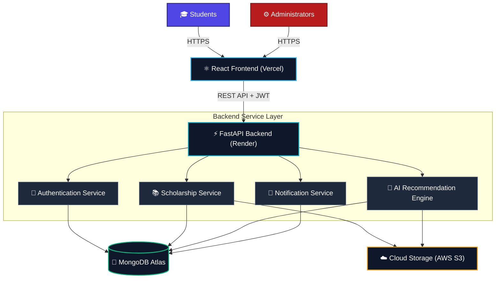

# 🎓 ScholarAI
> **One Platform. Every Scholarship. AI Guided.**

[](https://github.com/scholar-ai/platform)
[](https://opensource.org/licenses/MIT)
[](https://fastapi.tiangolo.com/)
[](https://reactjs.org/)
[](https://www.mongodb.com/)
[](#-ai-features)

---

ScholarAI is a next-generation, AI-driven scholarship discovery and application ecosystem. It bridges the critical information gap between students and life-changing financial aid. By matching students dynamically based on academics, demographics, and financial status, ScholarAI makes education opportunities universally accessible.

> [!IMPORTANT]
> ScholarAI is designed to scale as India's premier AI-powered Scholarship & Education Opportunity Platform, centralizing thousands of federal, state, corporate, and trust scholarships.

---

## 📌 Table of Contents

1. [📖 Project Overview](#-project-overview)
2. [🎯 Vision](#-vision)
3. [🏗️ System Architecture](#%EF%B8%8F-system-architecture)
4. [🛠️ Core Features](#%EF%B8%8F-core-features)
5. [📁 Folder Structure](#-folder-structure)
6. [💻 Technology Stack](#-technology-stack)
7. [🗄️ Database Collections](#%EF%B8%8F-database-collections)
8. [🔌 API Overview](#-api-overview)
9. [👥 User Roles](#-user-roles)
10. [🗺️ Development Roadmap](#%EF%B8%8F-development-roadmap)
11. [🔒 Security Protocols](#-security-protocols)
12. [⚙️ Installation & Setup](#%EF%B8%8F-installation--setup)
13. [📄 Environment Variables](#-environment-variables)
14. [🚀 Future Scope](#-future-scope)
15. [📸 Screenshots](#-screenshots)
16. [🤝 Contributing](#-contributing)
17. [📝 License](#-license)

---

## 📖 Project Overview

### The Real-World Problem
Every year, billions of rupees in scholarship funds remain unutilized. Meanwhile, thousands of talented students drop out of higher education due to financial constraints. The scholarship ecosystem is severely fragmented:
* **Information Asymmetry:** Scholarships are scattered across hundreds of government portals, corporate pages, NGO bulletins, and university sites.
* **Manual Sifting:** Students spend weeks searching through incompatible websites with complex eligibility rules.
* **Friction in Applications:** Unclear document requirements, mismatched deadlines, and lack of real-time application tracking lead to high dropout rates during submission.

### The ScholarAI Solution
ScholarAI solves this by aggregating, classifying, and matching opportunities using artificial intelligence:
* **AI-Powered Recommendation Engine:** Scans student academic history, financial profile, and demographic attributes to immediately recommend the top matching scholarships.
* **Instant Eligibility Checker:** Uses semantic parsing to cross-examine complex guidelines and verify eligibility in seconds.
* **Unified Application Dashboard:** Centralizes all applications, documents, status changes, and deadline alerts in one place.

---

## 🎯 Vision

Our long-term mission is to build the definitive **AI-powered Scholarship & Education Opportunity Platform for India and Beyond**. 

ScholarAI aims to integrate deeply with national systems (like DigiLocker) to verify academic scores securely, collaborate directly with academic institutions to expedite student verification, and partner with corporate CSR initiatives to host exclusive grant schemes. Ultimately, we seek to ensure that **no student is denied education due to a lack of resources**.

---

## 🏗️ System Architecture

ScholarAI operates on a modern, decoupled architecture designed for high availability, security, and scalability.



---

## 🛠️ Core Features

### 🎓 Student Portal
* **Secure Authentication:** Login/Registration via JWT, incorporating secure token storage.
* **Student Profile:** Set up demographic, economic, and academic credentials (GPA, family income, category, location).
* **AI Scholarship Recommendations:** Smart feeds tailored to matching student criteria.
* **Advanced Scholarship Search:** Search engine with precise multi-filter toggles.
* **Eligibility Checker:** Instant verification audit against any scholarship guidelines.
* **Saved Scholarships:** Bookmark opportunities to review later.
* **Application Tracker:** Live progress status mapping (Draft $\rightarrow$ Submitted $\rightarrow$ Under Review $\rightarrow$ Disbursed).
* **Document Manager:** Secure document vault supporting PDFs and images with category tagging.
* **Notifications:** Real-time push and email warnings regarding deadline updates and new match profiles.
* **Dashboard:** Unified command center displaying personalized metrics and timeline trackers.

### ⚙️ Admin Portal
* **Dashboard Analytics:** High-level metrics tracking total students registered, active scholarships, and disbursement success rates.
* **Scholarship Management:** CRUD tool to publish, modify, or archive scholarship listings.
* **Bulk Import:** Upload and validate large batches of scholarships directly using Excel/CSV templates.
* **Student Management:** View and audit student profiles, application states, and uploaded verification files.
* **Announcements Board:** Publish system-wide broadcasts or targeted messages.
* **Reports:** Export analytical reviews and disbursement metrics in CSV/PDF formats.
* **Settings:** Control global eligibility weighting policies and service keys.

### 🤖 AI Features
* **AI Recommendation Engine:** Employs cosine-similarity vector embeddings to map student profiles to scholarship criteria.
* **AI Eligibility Engine:** Processes raw criteria text via NLP to automatically parse and determine candidate validation rules.
* **AI Search:** Supports natural language semantic search (e.g., *"Show me computer science grants for female students in Maharashtra"*).
* **AI Application Checklist:** Auto-generates a custom checklist of required documents based on specific scholarship criteria.
* **AI Deadline Reminder:** Adaptive scheduler that notifications frequency as deadlines approach.

---

## 📁 Folder Structure

A production-ready decoupled workspace structure representing clean Separation of Concerns:

```
scholar-ai/
├── frontend/                  # React Frontend Application
│   ├── public/                # Static public assets
│   └── src/
│       ├── assets/            # Global styling, logo, images
│       ├── components/        # Reusable UI Components (Cards, Buttons, Modals)
│       ├── context/           # React Context providers (AuthContext, ThemeContext)
│       ├── hooks/             # Custom hooks (useAuth, useAxios, useFetch)
│       ├── layouts/           # Structural layouts (StudentLayout, AdminLayout)
│       ├── pages/             # Route-specific page components
│       ├── services/          # HTTP request services (Axios interceptors)
│       ├── utils/             # Date formatters, validation schemas, constants
│       ├── App.jsx            # Core routing and entry layout
│       └── main.jsx           # App entrypoint hook
├── backend/                   # FastAPI Backend Application
│   ├── app/
│   │   ├── api/               # API endpoints structured by version and module
│   │   ├── core/              # Security configurations, JWT, Database client
│   │   ├── models/            # Pydantic schema schemas and validation rules
│   │   ├── services/          # Business logic (AI recommendations, file ingestion)
│   │   ├── utils/             # Helper libraries (password hashes, mailers)
│   │   └── config.py          # Environment configuration models
│   ├── requirements.txt       # Python dependency declarations
│   └── main.py                # Server initialization and startup
├── docs/                      # Technical plans, API specs, and databases
├── assets/                    # Project screenshots and illustrations
│   └── screenshots/           # UI mockup screenshots
│       ├── landing_page.png
│       ├── student_dashboard.png
│       ├── scholarship_search.png
│       ├── scholarship_details.png
│       └── admin_dashboard.png
├── .env.example               # Reference configuration variables
├── LICENSE                    # MIT License
└── README.md                  # Project root documentation
```

---

## 💻 Technology Stack

### Frontend
* **UI Framework:** [React.js](https://react.dev/) (v18+) for component-driven UI compilation.
* **Styling:** [Tailwind CSS](https://tailwindcss.com/) for fully responsive, atomic layout configuration.
* **Routing:** [React Router v6](https://reactrouter.com/) handling Client-Side Routing (CSR) and guards.
* **Animations:** [Framer Motion](https://www.framer.com/motion/) for fluid state changes and glassmorphism micro-animations.
* **HTTP Client:** [Axios](https://axios-http.com/) incorporating response and request interceptors to pass bearer JWTs.

### Backend
* **Core API Framework:** [FastAPI](https://fastapi.tiangolo.com/) (Python 3.10+) serving high-performance, asynchronous endpoints.
* **Database Driver:** [Motor](https://motor.readthedocs.io/) representing the async driver for MongoDB.
* **Authentication:** JWT tokens featuring HMAC-SHA256 signature hashes.
* **AI & NLP:** [Sentence-Transformers](https://www.sbert.net/) for semantic profile similarity embeddings.

### Database & Storage
* **Primary Database:** [MongoDB Atlas](https://www.mongodb.com/atlas) for schema-less document storage.
* **Storage Solution:** AWS S3 or MinIO cloud buckets for encrypted document storage (Future Phase).

### Deployment & CI/CD
* **Frontend Hosting:** [Vercel](https://vercel.com/) with automatic pipeline execution.
* **Backend Hosting:** [Render](https://render.com/) running on Dockerized instances.
* **Database Hosting:** MongoDB Atlas Cloud Server.

---

## 🗄️ Database Collections

The MongoDB document architecture is divided into the following primary collections:

| Collection | Key Fields | Indexes | Purpose |
| :--- | :--- | :--- | :--- |
| **`users`** | `_id`, `email`, `hashed_password`, `role`, `is_verified` | `email` (Unique) | Houses core credential pairs and roles for JWT distribution. |
| **`student_profiles`** | `_id`, `user_id` (ref), `full_name`, `academic_score`, `family_income`, `category` | `user_id` (Unique) | Contains demographic, geographical, and grade points for matching algorithms. |
| **`scholarships`** | `_id`, `title`, `provider`, `amount`, `deadline`, `requirements` | `title` (Text), `deadline` | Stores detailed scholarship parameters and validation requirements. |
| **`applications`** | `_id`, `student_id` (ref), `scholarship_id` (ref), `status`, `logs` | `student_id`, `scholarship_id` | Tracks application states and historical review actions. |
| **`documents`** | `_id`, `student_id` (ref), `file_url`, `doc_type`, `verified` | `student_id` | Document metadata referencing secure cloud storage urls. |
| **`notifications`** | `_id`, `user_id` (ref), `title`, `message`, `is_read` | `user_id`, `is_read` | Handles event warnings, reminders, and user alerts. |
| **`announcements`** | `_id`, `title`, `body`, `target_role`, `created_at` | `created_at` | Broadcast posts configured by admins for user display. |

---

## 🔌 API Overview

### Authentication
* `POST /api/v1/auth/register` - Registers student credentials.
* `POST /api/v1/auth/login` - Validates credentials and returns JWT.

### Student Profiles
* `GET /api/v1/student/profile` - Pulls logged-in student profile.
* `PUT /api/v1/student/profile` - Updates demographic and academic data.

### Scholarship Database
* `GET /api/v1/scholarships` - Lists scholarships with pagination & search.
* `GET /api/v1/scholarships/{id}` - Details for a specific scholarship.

### Application Processing
* `POST /api/v1/applications` - Initialise scholarship application.
* `GET /api/v1/applications/my-applications` - Fetch student application logs.

### Administration & Management
* `POST /api/v1/admin/scholarships/bulk-import` - Endpoint accepting Excel/CSV.
* `GET /api/v1/admin/students` - Detailed list of registered student accounts.

### AI Engine
* `GET /api/v1/ai/recommendations` - Run vectors to match active opportunities.
* `POST /api/v1/ai/check-eligibility` - Run NLP rules validation against a specific scholarship.

> [!TIP]
> The interactive OpenAPI Swagger documentation is available at `{BACKEND_URL}/docs` when running the backend in development mode.

---

## 👥 User Roles

### 1. Student
* **Permissions:** Read/Write personal profiles, upload verification materials, search/apply to scholarships, view status updates.
* **Responsibilities:** Submitting accurate certificates, verifying academic profiles, tracking deadlines.

### 2. College (Future Scope)
* **Permissions:** Verify and approve academic credentials submitted by their enrolled students, register institutional scholarship programs, run reports on awarded financial aids.
* **Responsibilities:** Authenticating institutional scores, certifying attendance.

### 3. Administrator
* **Permissions:** CRUD on all scholarships, bulk import assets, manage platform-wide user list, view global analytical metrics, publish system announcements.
* **Responsibilities:** Vetting incoming scholarship data accuracy, managing support queues, overriding application failures.

---

## 🗺️ Development Roadmap

```
├── Phase 1: Foundation (Current)
│   ├── JWT Auth & Profile Setup
│   ├── MongoDB Atlas Configuration
│   ├── Scholarship CRUD & Bulk Ingestion API
│   └── Base Responsive UI Pages
├── Phase 2: AI Core & Reminders (Upcoming)
│   ├── Vector Embedding Matching Pipeline
│   ├── NLP Rule-parsing for Eligibility Checking
│   ├── Transactional Email & Push System
│   └── Live Application Progress Stepper
└── Phase 3: Cognitive Integration (Future)
    ├── PDF Parser (OCR GPA verification)
    ├── ScholarGPT Chatbot Guidance
    ├── AI URL Scraper (Auto-ingestion)
    └── Multilingual Interface Adaptations
```

---

## 🔒 Security Protocols

We implement rigorous enterprise-level security protocols:
1. **JWT Verification:** Fully signed payloads utilizing HMAC-SHA256, carrying 30-minute expiry periods.
2. **Password Cryptography:** Password storage using `bcrypt` incorporating a salt round workload of 12.
3. **Role-Based Access Control (RBAC):** Middleware checks validating user claims at every restricted backend entry-point.
4. **Input Sanitization:** Structured inputs parsed against rigid Pydantic models on backend endpoints; Formik and Yup validation rules applied to all client fields.
5. **Secure Object Uploads:** File constraints verifying MIME-type signatures, enforcing a 5MB size ceiling, and stripping filenames of directory traversal sequences.

---

## ⚙️ Installation & Setup

### Prerequisites
* **Python** (v3.10+) installed.
* **Node.js** (v18+) installed.
* **MongoDB Atlas** account or local MongoDB instance running.

---

### Step 1: Clone the Repository
```bash
git clone https://github.com/scholar-ai/platform.git
cd platform
```

### Step 2: Configure Environment Variables
Create a `.env` file inside the `backend` and `frontend` folders using the templates provided in the [.env.example](#-environment-variables) section.

---

### Step 3: Backend Installation
1. Navigate to the `backend` folder:
   ```bash
   cd backend
   ```
2. Create and activate a virtual environment:
   * **Windows:**
     ```powershell
     python -m venv venv
     .\venv\Scripts\Activate.ps1
     ```
   * **macOS/Linux:**
     ```bash
     python3 -m venv venv
     source venv/bin/activate
     ```
3. Install dependencies:
   ```bash
   pip install -r requirements.txt
   ```
4. Start the FastAPI development server:
   ```bash
   uvicorn app.main:app --reload
   ```

---

### Step 4: Frontend Installation
1. Open a new terminal and navigate to the `frontend` folder:
   ```bash
   cd frontend
   ```
2. Install the required Node packages:
   ```bash
   npm install
   ```
3. Start the Vite React development server:
   ```bash
   npm run dev
   ```

---

## 📄 Environment Variables

### Backend Configuration (`backend/.env`)
Create `backend/.env` with the following variables:
```env
# Server Configuration
PORT=8000
ENVIRONMENT=development
SECRET_KEY=your_super_secret_jwt_signature_key_here
ACCESS_TOKEN_EXPIRE_MINUTES=30

# MongoDB Configuration
MONGODB_URI=mongodb+srv://<username>:<password>@cluster.mongodb.net/scholarai?retryWrites=true&w=majority

# AI Engine Configurations
MODEL_NAME=all-MiniLM-L6-v2

# Storage Configurations (Future S3 Upload)
AWS_ACCESS_KEY_ID=your_aws_key
AWS_SECRET_ACCESS_KEY=your_aws_secret
AWS_BUCKET_NAME=scholarai-documents
```

### Frontend Configuration (`frontend/.env`)
Create `frontend/.env` with the following variables:
```env
# API Base Endpoint
VITE_API_URL=http://localhost:8000/api/v1
```

---

## 🚀 Future Scope

* **AI Career Guidance:** Integrate a career paths recommendation engine recommending scholarships mapping to desired student profiles.
* **Education Loan Integration:** Enable digital links to leading banking institutions providing micro-loans.
* **Internships & Research Grants:** Dedicated tracks for research-based funding opportunities.
* **Scholarship Disbursement Analytics:** Predict global trends and demand spikes using machine learning.
* **ScholarAI Mobile App:** Dedicated iOS and Android native apps built on React Native.

---

## 📸 Screenshots

Here is a visual walk-through of the ScholarAI platform:

### 🌟 Landing Page
A dark-themed, glassmorphic landing page designed to attract and guide students immediately.


### 📊 Student Dashboard
The student central command center, offering personalized match indexes, notification tickers, and active checklist tracking.


### 🔍 Scholarship Search
Advanced filtering panel combined with intuitive card structures displaying search results.


### 📄 Scholarship Details
Detailed visual breakdowns of individual scholarships alongside verification requirements.


### 👑 Admin Dashboard & Analytics
Global admin analytics dashboard showing application rates, student demographics, and disbursement charts.


---

## 🤝 Contributing

Contributions are what make the open source community such an amazing place to learn, inspire, and create. Any contributions you make are **greatly appreciated**.

1. **Fork the Project** (`https://github.com/scholar-ai/platform/fork`)
2. **Create your Feature Branch** (`git checkout -b feature/AmazingFeature`)
3. **Commit your Changes** (`git commit -m 'Add some AmazingFeature'`)
4. **Push to the Branch** (`git push origin feature/AmazingFeature`)
5. **Open a Pull Request**

---

## 📝 License

Distributed under the MIT License. See [LICENSE](LICENSE) for more information.